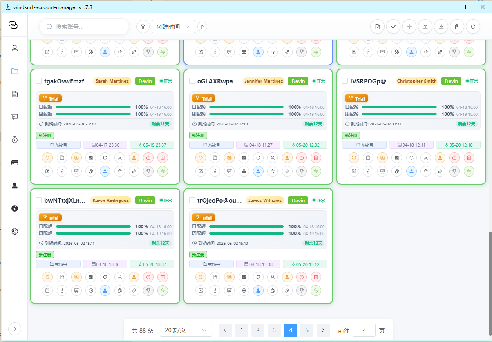
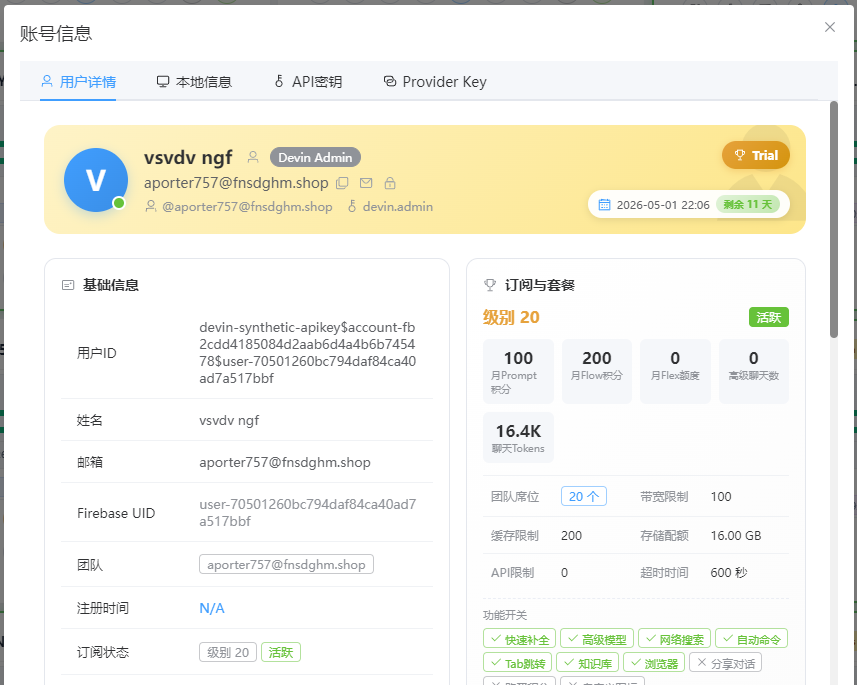
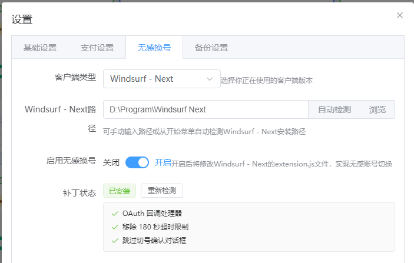

# Windsurf Account Manager - Simple

A Windsurf multi-account management desktop application built with Tauri + Vue 3 + TypeScript, designed to manage multiple Windsurf accounts with features including credit reset, billing query, one-click account switching, subscription payment, and more.

> ⚠️ **Free Software Notice**: This software is completely free. If you paid for it, you have been scammed!

## 📦 Project Information

- **Current Version**: 1.7.3
- **License**: AGPL-3.0
- **Development Language**: Rust + TypeScript
- **Supported Platforms**: Windows 10/11
- **Architecture**: Tauri 2.x Desktop Application

**🌐 中文版本**: [README.md](README.md)

## 📱 Community

<p align="center">
  
  &nbsp;&nbsp;&nbsp;&nbsp;
  
</p>

---

## 🖥️ Software Interface

<p align="center">
  
</p>

<p align="center">
  
</p>

<p align="center">
  
</p>

---

## ✨ Features

### 🔐 Account Management
- ✅ **Add/Edit/Delete Accounts** - Complete CRUD operations for accounts
- ✅ **Account Grouping** - Custom groups for managing multiple accounts
- ✅ **Tag System** - Add custom tags to accounts
- ✅ **Real-time Status Display** - Show plan type, credit balance, expiration time, etc.
- ✅ **Batch Operations** - Batch select, reset, delete accounts
- ✅ **Encrypted Storage** - AES-256-GCM encryption, keys stored in system keychain

### 💳 Credit Reset
- ✅ **One-click Credit Reset** - Reset credits via seat update API
- ✅ **Smart Seat Rotation** - Auto-rotate between 3/4/5 seats
- ✅ **Batch Reset** - Support multiple accounts simultaneously (max 5 concurrent)
- ✅ **Team Batch Reset** - One-click reset all team members' credits
- ✅ **Auto Reset Schedule** - Set scheduled tasks for automatic credit reset

### 👥 Team Management
- ✅ **View Team Members** - List all team members
- ✅ **Invite Members** - Invite new members via email
- ✅ **Remove Members** - Remove specified members from team
- ✅ **Team Credit Management** - Unified management of team member credits

### 🔄 One-click Account Switching
- ✅ **Quick Account Switch** - Fast switch to other Windsurf accounts
- ✅ **Auto Token Refresh** - Auto-refresh access_token using refresh_token
- ✅ **OAuth Callback** - Auto-complete login via windsurf:// protocol
- ✅ **Machine ID Reset** - Reset device identifier for multi-device use (requires admin privileges)

### 🔧 Seamless Switching Patch
- ✅ **Auto-detect Windsurf Path** - Automatically find Windsurf installation
- ✅ **One-click Patch** - Modify extension.js for seamless switching
- ✅ **Remove Timeout Limit** - Remove 180-second OAuth timeout
- ✅ **Auto Backup** - Auto-backup original file before patching (max 3 copies)
- ✅ **One-click Restore** - Restore original state from backup
- ✅ **Auto Restart Windsurf** - Auto-restart Windsurf after patch application

### 🛑 Cunzhi Feature
- ✅ **MCP Tool Integration** - Provide dialog-helper and confirm tools
- ✅ **Dialog Assistant** - Help users confirm operations and input information
- ✅ **Cross-platform Support** - Support Windows, Linux, macOS
- ✅ **Binary File Management** - Copy platform-specific files during build
- ✅ **Smart Packaging** - Avoid packaging all platform files, reduce installer size

### 💰 Payment Related
- ✅ **Virtual Card Generation** - Generate virtual credit card info for payment testing
- ✅ **Custom BIN** - Support custom BIN number or BIN range
- ✅ **Private Payment Window** - Open Stripe payment page in incognito browser window
- ✅ **Alipay/WeChat Payment** - Support domestic payment methods (donation)

### 📊 Data Query
- ✅ **Billing Query** - Query plan, quota, usage, etc.
- ✅ **Subscription Status** - Show subscription type, expiration, next billing date
- ✅ **Usage Statistics** - View credit usage and remaining quota
- ✅ **Global Refresh** - One-click refresh all account info

### ⚙️ System Settings
- ✅ **Proxy Configuration** - Support HTTP proxy settings
- ✅ **Lightweight API Mode** - Use GetPlanStatus instead of GetCurrentUser to reduce requests
- ✅ **Detailed Results** - Optional display of detailed API response
- ✅ **Operation Logs** - Record all operation history, support export

### 🔒 Data Security
- ✅ **System Keychain** - Use Windows Credential Manager to store encryption keys
- ✅ **AES-256-GCM Encryption** - All sensitive data encrypted
- ✅ **Local Storage** - Data stored locally only, no server upload
- ✅ **Operation Logs** - Complete operation records for auditing

### 🌐 Multi-client Support
- ✅ **Windsurf Standard** - Full support for official Windsurf client
- ✅ **Windsurf - Next** - Support Next version with independent configuration and management
- ✅ **Auto-detection** - Automatically identify and adapt to different client versions
- ✅ **Independent Configuration** - Different clients use independent config files and data storage

### 🤖 Devin Account System
- ✅ **auth1_token Authentication** - Support Devin's auth1_token authentication mechanism
- ✅ **session_token Management** - Auto-refresh session_token with 32-day placeholder mechanism
- ✅ **Multi-organization Support** - Support Devin multi-organization account management
- ✅ **Smart Refresh** - Force refresh triggered by 401 errors
- ✅ **Key Field Backfill** - Auto-supplement key fields like product parameter

---

## 📜 Version History

### v1.7.3 (2026-04-20)
- **Fixed Devin Refresh Logic**: Added key field backfill, fixed product parameter case sensitivity, and improved batch refresh store synchronization
- Optimized Devin session_token expiration placeholder mechanism
- Improved seamless switching progress event system

### v1.7.2 (2026-04-18)
- **Added Complete Devin Account System Support**: Implemented auth1_token authentication, session_token refresh, and 5-header authentication mechanism
- Optimized update_codeium_access error handling: Added Connect Protocol error code mapping and transparent logging
- Improved Devin session_token management logic

### v1.7.1 (2026-04-14)
- **Added Multi-client Support**: Support independent configuration and management for Windsurf and Windsurf - Next
- Optimized client detection logic
- Improved configuration file path management

### v1.7.0 (2026-04-10)
- **Added Billing Strategy and Quota Detail Field Support**: Support for billing_strategy, daily_quota, weekly_quota, etc.
- Extended OperationType enum: Added group, tag, team, data management, account switching, subscription, and registration operation types
- Optimized batch refresh logic: Reuse apply_plan_status_to_account function and simplify account update process

### v1.6.7 (2026-01-09)
- Fixed Cunzhi feature issues
- Optimized stability

### v1.6.6 (2026-01-08)
- **Refactored Subscription Payment Feature**: Support Teams/Pro plans and monthly/yearly billing
- Refactored MCP tool naming: Unified `windsurf-cunzhi` and `zhi` tools to `dialog-helper` and `confirm`

### v1.6.5 (2025-12-30)
- Restored full functionality version
- Removed unused Rank icon import
- Added QQ group QR code to README community section
- Updated README.md: Improved feature description and interface display

### v1.6.4 (2025-12-24)
- **Optimized Analytics Data Retrieval Logic**: Improved GetAnalytics API call efficiency
- Updated windsurf-cunzhi and windsurf-cunzhi-ui binary files for all platforms
- Optimized cunzhi file packaging strategy: Copy platform-specific files during build to avoid packaging all platform files
- Fixed Linux ARM64 connector issue
- Skipped AppImage packaging in Linux ARM64 build, only generate deb and rpm packages

---

## Tech Stack

### Frontend
- **Framework**: Vue 3.5.13 + TypeScript 5.6.2
- **UI Components**: Element Plus 2.11.8
- **Icon Library**: @element-plus/icons-vue 2.3.2
- **State Management**: Pinia 3.0.4
- **Build Tool**: Vite 6.0.3
- **Styling**: CSS3 + Element Plus Theme + Sass 1.94.2
- **HTTP Client**: Axios 1.13.2
- **Encryption Library**: Crypto-js 4.2.0
- **Date Processing**: Dayjs 1.11.19
- **Chart Library**: ECharts 6.0.0
- **Drag & Drop**: Vuedraggable 4.1.0
- **UUID Generation**: UUID 13.0.0

### Backend
- **Framework**: Tauri 2.x
- **Language**: Rust 2021 Edition
- **Encryption**: AES-256-GCM (aes-gcm 0.10)
- **Key Management**: Windows Credential Manager / Keyring 2.0
- **Network Requests**: Reqwest 0.11 (supports JSON, SOCKS proxy)
- **Async Runtime**: Tokio 1.x (full features)
- **Serialization**: Serde 1.0 + Serde JSON 1.0
- **Database**: SQLite 3.31 (bundled) - For Windsurf state.vscdb operations
- **Time Processing**: Chrono 0.4
- **Encoding**: Base64 0.21 + Hex 0.4
- **Error Handling**: Anyhow 1.0 + Thiserror 1.0
- **Logging**: Log 0.4 + Env Logger 0.10
- **File Compression**: Zip 0.6
- **Regular Expression**: Regex 1.10

### Windows-specific Dependencies
- **Registry Operations**: Winreg 0.52
- **Windows API**: Winapi 0.3 (securitybaseapi, processthreadsapi, winnt, handleapi, minwindef, shellapi, winuser)

### Unix-specific Dependencies
- **System Calls**: Libc 0.2

## Installation and Running

### Prerequisites
- Node.js 16+
- Rust 1.70+
- Windows 10/11 (currently only supports Windows)

### Development Environment

```bash
# Clone the project
git clone https://github.com/chaogei/windsurf-account-manager-simple.git
cd windsurf-account-manager-simple

# Install dependencies
npm install

# Run in development mode
npm run tauri dev
```

### Build Release Version

```bash
# Build Windows installer
npm run tauri build
```

After building, the installer is located at `src-tauri/target/release/bundle/`

## Usage Guide

### 1. First Use

1. After starting the application, click the "Add Account" button (+ icon) in the top right
2. Enter Windsurf account information in the dialog:
   - **Email**: Your Windsurf account email
   - **Password**: Account password
   - **Display Name**: Easy-to-identify name (optional)
   - **Group**: Select or create a group (optional)
   - **Tags**: Add custom tags (optional)
3. Click "OK" to save the account
4. The application will automatically log in and fetch account information

### 2. Credit Reset

**Single Account Reset**:
1. Click the "Credit Reset" button (refresh icon) on the account card
2. The application will automatically:
   - Log in to get Token (if needed)
   - Execute a seat update (auto-switch between 3/4/5)
   - Credit reset is complete when seat update succeeds
3. Operation result will be notified
4. Enable "Show Detailed Results" in settings to view specific seat update information

**Batch Reset**:
1. Check multiple account cards
2. Click the "Batch Reset Credits" button at the top
3. Confirm to execute in batch (max 5 concurrent)
4. View operation logs for detailed results

**Auto Reset**:
1. Click the "Auto Reset" button
2. Set reset schedule (time, frequency, accounts)
3. System will automatically execute reset at specified time
4. View auto reset records in operation logs

### 3. Batch Operations

**Batch Import**:
1. Click the "Batch Import" button (multiple squares icon)
2. Prepare account list file, format:
   ```
   email password note
   user1@example.com password123 account1
   user2@example.com password456 account2
   ```
3. Select file and import
4. Confirm import information

**Batch Delete**:
1. Check the account cards to delete
2. Click the "Batch Delete" button (trash icon)
3. Confirm delete operation

**Batch Refresh**:
1. Check the account cards to refresh
2. Click the "Batch Refresh Status" button
3. System will batch update account credits, plans, etc.

**Export Accounts**:
1. Click the "Export Accounts" button (download icon)
2. Select export format (CSV/JSON/Text)
3. File will be automatically downloaded locally

### 4. Account Grouping

**Create Group**:
1. Click the "Groups" menu in the sidebar
2. Click the "Add Group" button
3. Enter group name and color
4. Save group

**Manage Groups**:
1. Edit or delete groups in the group list
2. Select group when adding/editing accounts
3. Groups help you better manage multiple accounts

### 5. Tag Management

**Add Tags**:
1. Click the "Tags" input field when adding/editing accounts
2. Enter tag name
3. Select tag color
4. Save tag

**Manage Tags**:
1. Click "Tag Management" in settings
2. Edit or delete existing tags
3. Tags help you quickly filter accounts

### 6. Team Management

**View Team Members**:
1. Click the "Team Management" button on the account card
2. View all team member information
3. View member credit usage

**Invite Members**:
1. Click "Invite Member" in the team management dialog
2. Enter member email
3. Set member permissions
4. Send invitation

**Remove Members**:
1. Select the member to remove in the member list
2. Click the "Remove Member" button
3. Confirm removal operation

### 7. One-click Account Switching

**Standard Switching**:
1. Click the "Switch" button (Switch icon) on the account card
2. System will automatically:
   - Use refresh_token to get new access_token
   - Call RegisterUser API to get api_key
   - Encrypt sessions data and write to Windsurf database
   - Update Windsurf configuration files
   - Reset machine ID
   - Auto-restart Windsurf
3. Wait for Windsurf restart to complete

**Seamless Switching (requires patch)**:
1. Click the "Seamless Switching Patch" button
2. System will automatically detect Windsurf installation path
3. Click "Apply Patch" to modify extension.js
4. Patch will remove 180-second timeout limit
5. Restart Windsurf after applying patch
6. Afterwards, you can click "Seamless Switch" button anytime for quick switching

### 8. View Logs

1. Click "Operation Logs" in the sidebar
2. View all operation records
3. Filter logs by type and time
4. Support clearing or exporting logs

### 9. Billing Query

**View Billing Information**:
1. Click the "Billing" button on the account card
2. View subscription type, expiration time
3. View payment method, next billing date
4. View invoice link

**Update Plan**:
1. Click the "Update Plan" button
2. Select new plan type (Teams/Pro)
3. Select billing cycle (monthly/yearly)
4. Confirm update

### 10. Usage Analytics

**View Usage Statistics**:
1. Click the "Analytics" button on the account card
2. View daily active statistics
3. View tool usage
4. View model usage
5. View Token consumption statistics

## Data Storage

### Application Data Storage

Application data is stored locally:
- **Windows**: `%APPDATA%\com.chao.windsurf-account-manager\accounts.json`

Data structure includes:
- Account information (encrypted passwords and Tokens)
- Group list
- System settings
- Operation logs

### Windsurf Data Storage Architecture

Windsurf uses a three-layer storage architecture to manage login credentials:

**1. Encrypted Layer**
- **Storage Location**: `secret://windsurf_auth.sessions`
- **Encryption Method**: Windows DPAPI encryption
- **Data Format**: Buffer byte array
- **Purpose**: Store session data and API Key

**2. Status Layer**
- **Storage Location**: `windsurfAuthStatus`
- **Data Format**: Plain text JSON
- **Contains**: API Key (sk-ws-01 prefix), user information, team configuration
- **Purpose**: Store authentication status and basic user information

**3. Plain Text Layer**
- **Storage Location**: `codeium.windsurf-windsurf_auth` and `codeium.windsurf`
- **Data Format**: Plain text
- **Contains**: Username, basic configuration
- **Purpose**: Store user identifier and configuration information

### Key File Paths

**Database File**:
- **Path**: `%APPDATA%\Windsurf\User\globalStorage\state.vscdb`
- **Format**: SQLite
- **Table Name**: ItemTable (key-value storage)

**Configuration File**:
- **Path**: `%APPDATA%\Windsurf\User\globalStorage\storage.json`
- **Format**: JSON
- **Contains**: Machine ID, device identifier, etc.

### Security Mechanisms

- **Windows Credential Manager Integration**: Encryption keys stored in system keychain
- **DPAPI Encryption**: Bound to user account, only current user can decrypt
- **Protobuf Encoding**: Permission configuration uses Protobuf encoding
- **Important Note**: API Key is stored in plain text in windsurfAuthStatus, protecting the database file is crucial

## Security Notes

1. **Password Security**: All passwords are encrypted with AES-256-GCM
2. **Key Management**: Encryption keys are stored in the system keychain
3. **Token Refresh**: Tokens are automatically refreshed 5 minutes before expiration
4. **Local Storage**: All data is stored locally only, not uploaded to any server

## Important Notes

1. Please keep your account information safe
2. Regularly backup the `accounts.json` file
3. Pay attention to API rate limiting during batch operations
4. It is recommended to use the grouping feature to manage multiple accounts

## Development Guide

### Project Structure

```
windsurf-account-manager-simple/
├── src/                           # Vue frontend source code
│   ├── views/                     # Page components
│   │   └── MainLayout.vue         # Main layout page (contains all features)
│   ├── components/                # Reusable components
│   │   ├── AboutDialog.vue        # About dialog
│   │   ├── AccountCard.vue        # Account card component
│   │   ├── AccountInfoDialog.vue  # Account detail dialog
│   │   ├── AddAccountDialog.vue   # Add account dialog
│   │   ├── AnalyticsDialog.vue    # Usage analytics dialog
│   │   ├── AutoRefillDialog.vue   # Auto refill dialog
│   │   ├── AutoResetDialog.vue    # Auto reset dialog
│   │   ├── BatchImportDialog.vue  # Batch import dialog
│   │   ├── BatchUpdatePlanDialog.vue  # Batch update plan dialog
│   │   ├── BillingDialog.vue      # Billing info dialog
│   │   ├── CardGeneratorDialog.vue   # Virtual card generation dialog
│   │   ├── CreditHistoryDialog.vue    # Credit history dialog
│   │   ├── EditAccountDialog.vue  # Edit account dialog
│   │   ├── LogsDialog.vue        # Operation logs dialog
│   │   ├── SettingsDialog.vue    # Settings dialog
│   │   ├── StatsDialog.vue       # Statistics dialog
│   │   ├── TagColorPicker.vue    # Tag color picker
│   │   ├── TagManageDialog.vue   # Tag management dialog
│   │   ├── TeamManagementDialog.vue  # Team management dialog
│   │   ├── TeamSettingsDialog.vue    # Team settings dialog
│   │   ├── TurnstileDialog.vue   # Turnstile verification dialog
│   │   ├── UpdatePlanDialog.vue  # Update plan dialog
│   │   ├── UpdateSeatsResultDialog.vue  # Seat update result dialog
│   │   └── WelcomeDialog.vue     # Welcome dialog
│   ├── api/                       # API wrapper layer
│   ├── services/                  # Business service layer
│   ├── store/                     # Pinia state management
│   ├── types/                     # TypeScript type definitions
│   ├── utils/                     # Utility functions
│   ├── assets/                    # Static resources
│   ├── App.vue                    # Root component
│   └── main.ts                    # Application entry
├── src-tauri/                     # Rust backend source code
│   ├── src/
│   │   ├── commands/              # Tauri command layer (frontend-backend communication interface)
│   │   │   ├── account_commands.rs    # Account management commands
│   │   │   ├── analytics_commands.rs  # Analytics data commands
│   │   │   ├── api_commands.rs        # API call commands
│   │   │   ├── auto_reset_commands.rs # Auto reset commands
│   │   │   ├── cunzhi_commands.rs     # Cunzhi feature commands
│   │   │   ├── devin_commands.rs      # Devin account commands
│   │   │   ├── payment_commands.rs    # Payment related commands
│   │   │   ├── patch_commands.rs      # Patch application commands
│   │   │   ├── proto_commands.rs      # Protobuf parsing commands
│   │   │   ├── settings_commands.rs   # Settings related commands
│   │   │   ├── switch_account_commands.rs  # Account switching commands
│   │   │   ├── team_commands.rs       # Team management commands
│   │   │   ├── app_info.rs            # App info commands
│   │   │   ├── validate_path.rs       # Path validation commands
│   │   │   ├── windsurf_info.rs       # Windsurf info commands
│   │   │   └── mod.rs                 # Command module entry
│   │   ├── models/               # Data models
│   │   │   ├── account.rs       # Account model
│   │   │   ├── group.rs         # Group model
│   │   │   ├── operation_log.rs # Operation log model
│   │   │   └── settings.rs      # Settings model
│   │   ├── repository/           # Data access layer
│   │   │   └── data_store.rs    # Data storage implementation
│   │   ├── services/             # Business logic layer
│   │   │   ├── auth_service.rs  # Authentication service
│   │   │   └── windsurf_service.rs  # Windsurf API service
│   │   ├── utils/                # Utility functions
│   │   │   ├── crypto.rs        # Encryption tools
│   │   │   ├── proto_parser.rs  # Protobuf parser
│   │   │   └── error.rs         # Error handling
│   │   ├── lib.rs               # Rust library entry
│   │   └── main.rs              # Tauri application entry
│   ├── Cargo.toml               # Rust dependency configuration
│   ├── tauri.conf.json          # Tauri configuration file
│   └── build.rs                 # Build script
├── public/                      # Public resources
│   ├── 交流群.png               # WeChat group QR code
│   ├── QQ群.jpg                 # QQ group QR code
│   └── 主页.png                 # Interface screenshot
├── scripts/                     # Script tools
│   └── sync-version.js          # Version sync script
├── docs/                        # Documentation directory
├── package.json                 # Node dependency configuration
├── vite.config.ts               # Vite configuration
├── tsconfig.json                # TypeScript configuration
├── tsconfig.node.json           # Node environment TypeScript configuration
├── build_with_admin.bat         # Admin privilege build script
├── set_admin_manifest.ps1       # Set admin manifest script
└── README.md                    # Project documentation
```

### API Integration

The application integrates the following Windsurf APIs:

#### Firebase Authentication API
- **Endpoint**: `https://identitytoolkit.googleapis.com/v1/accounts:signInWithPassword`
- **Endpoint**: `https://securetoken.googleapis.com/v1/token`
- **Function**: User login, Token refresh
- **Authentication**: API Key + Referer header
- **Important**: Must carry `Referer: https://windsurf.com/` header, otherwise returns 403 error (`API_KEY_HTTP_REFERRER_BLOCKED`)
- **Recommended**: Also add `X-Client-Version: Chrome/JsCore/11.0.0/FirebaseCore-web` header

#### Seat Management API
- **UpdateSeats**: Update team seat count
  - Endpoint: `https://web-backend.windsurf.com/exa.seat_management_pb.SeatManagementService/UpdateSeats`
  - Function: Reset credits by modifying seat count
  - Protocol: Connect-Web (gRPC-Web)
  - Request Format: Protobuf

- **GetPlanStatus**: Get account plan status
  - Endpoint: `https://web-backend.windsurf.com/exa.seat_management_pb.SeatManagementService/GetPlanStatus`
  - Function: Get credit balance, quota info, billing strategy
  - Response Fields: available_flex_credits, available_prompt_credits, used_flex_credits, used_prompt_credits, billing_strategy, daily_quota, weekly_quota

#### Billing Query API
- **GetTeamBilling**: Get team billing information
  - Endpoint: `https://web-backend.windsurf.com/exa.seat_management_pb.SeatManagementService/GetTeamBilling`
  - Function: Query subscription status, payment method, billing cycle
  - Response Fields: Subscription type, seat count, unit price, payment method, next billing date

#### User Management API
- **GetCurrentUser**: Get current user information
  - Endpoint: `https://web-backend.windsurf.com/exa.seat_management_pb.SeatManagementService/GetCurrentUser`
  - Function: Get user basic info, team info, plan info, permission info
  - Response Fields: UserBasicInfo, TeamInfo, PlanInfo, UserRole

- **GetUsers**: Get team member list
  - Endpoint: `https://web-backend.windsurf.com/exa.seat_management_pb.SeatManagementService/GetUsers`
  - Function: Batch get team member information
  - Response Fields: users[], user_roles[], user_team_details[], user_cascade_details[]

- **RegisterUser**: Register user to get API Key
  - Endpoint: `https://register.windsurf.com/exa.seat_management_pb.SeatManagementService/RegisterUser`
  - Function: Use Firebase Token to register and get sk-ws-01 format API Key
  - Response Fields: api_key, name, api_server_url

**API Key Format Description**:
- **Format**: sk-ws-01-[88-94 characters Base64 encoded]
- **Total Length**: 103 characters
- **Structure**: sk(Secret Key) + ws(WindSurf) + 01(version) + Base64 encoded payload
- **Character Distribution**: Uppercase 35%, lowercase 45%, numbers 17%, hyphens 4%
- **Randomness**: 96.7% (close to maximum entropy, high security)
- **Encoding**: Base64 encoding, decodes to 32 bytes binary data
- **Acquisition Flow**: Firebase login to get ID Token → Call RegisterUser API → Return sk-ws-01 format API Key
- **Important**: RegisterUser API supports both register.windsurf.com and web-backend.windsurf.com

#### Team Management API
- **InviteTeamMember**: Invite team member
- **RemoveTeamMember**: Remove team member
- **UpdateTeamSettings**: Update team settings

#### Analytics Data API
- **GetAnalytics**: Get usage analytics data
  - Endpoint: `https://web-backend.windsurf.com/exa.user_analytics_pb.UserAnalyticsService/GetAnalytics`
  - Function: Get daily active statistics, tool usage, model usage, Token consumption
  - Response Fields: cascade_lines, cascade_tool_usage, cascade_runs, daily_active_user_counts

#### Credit History API
- **GetTeamCreditEntries**: Get credit acquisition history
  - Endpoint: `https://web-backend.windsurf.com/exa.seat_management_pb.SeatManagementService/GetTeamCreditEntries`
  - Function: Query credit acquisition records (referral rewards, purchases, etc.)
  - Response Fields: FlexCreditChronicalEntry (team ID, grant time, credit amount, type, reason)

#### Referral Code API
- **ProcessReferralCode**: Process referral code
  - Endpoint: `https://web-backend.windsurf.com/exa.seat_management_pb.SeatManagementService/ProcessReferralCode`
  - Function: Use referral code to get 25,000 PROMPT credit reward
  - Request Fields: auth_token, referral_code

#### Devin API
- **auth1_token Authentication**: Devin exclusive authentication mechanism
- **session_token Refresh**: Auto-refresh session_token
- **5-header Authentication**: Complete authentication header setup

---

### Request Header Format Description

Windsurf API calls require complete browser-related request headers:

**Required Headers**:
- `connect-protocol-version: "1"` - Connect-Web protocol version
- `x-debug-email: ""` - Debug email (empty string)
- `x-debug-team-name: ""` - Debug team name (empty string)
- `Referer: https://windsurf.com/` - Referer header (required for Firebase API)
- `X-Client-Version: Chrome/JsCore/11.0.0/FirebaseCore-web` - Client version (recommended)

**Browser Identification Headers**:
- `sec-ch-ua` - User agent hint
- `sec-ch-ua-mobile` - Mobile device hint
- `sec-ch-ua-platform` - Platform hint
- `User-Agent` - Complete user agent string

### Request Body Format

**UpdateSeats Request Body**:
- Prefix: `0x0a, 0xa1, 0x07` (fixed protocol identifier)
- Token: Authentication Token
- Seat Bytes: `0x10, seat_count`

**GetTeamBilling Request Body**:
- Prefix: `0x0a, 0xa1, 0x07` (fixed protocol identifier)
- Token: Authentication Token

**Note**: Prefix `0xa1 0x07` is a fixed protocol identifier, do not modify

---

### Architecture Design

#### Overall Architecture
The application adopts **Tauri desktop application architecture** with frontend-backend separation:

```
┌─────────────────────────────────────────────────────────┐
│                     Frontend (Vue 3)                    │
│  ┌──────────────┐  ┌──────────────┐  ┌──────────────┐ │
│  │  UI Layer    │  │  State Layer │  │  API Layer    │ │
│  │  Components  │  │    Pinia     │  │   Axios/Tauri │ │
│  └──────────────┘  └──────────────┘  └──────────────┘ │
└─────────────────────────────────────────────────────────┘
                           │
                    Tauri IPC
                           │
┌─────────────────────────────────────────────────────────┐
│                    Backend (Rust)                       │
│  ┌──────────────┐  ┌──────────────┐  ┌──────────────┐ │
│  │  Command     │  │   Service    │  │   Repository │ │
│  │  Layer       │  │    Layer     │  │     Layer     │ │
│  └──────────────┘  └──────────────┘  └──────────────┘ │
│  ┌──────────────┐  ┌──────────────┐  ┌──────────────┐ │
│  │   Model      │  │    Utils     │  │    Crypto     │ │
│  │   Layer      │  │    Layer     │  │    Layer      │ │
│  └──────────────┘  └──────────────┘  └──────────────┘ │
└─────────────────────────────────────────────────────────┘
```

#### Layered Design

**1. Frontend Layering**
- **UI Component Layer**: Reusable Vue components (dialogs, cards, forms, etc.)
- **State Management Layer**: Pinia Store manages application state
- **API Call Layer**: Encapsulates Tauri IPC calls, communicates with backend

**2. Backend Layering**
- **Command Layer (Commands)**: Tauri command interfaces, handle frontend requests
- **Service Layer (Services)**: Business logic processing (authentication, API calls, etc.)
- **Data Layer (Repository)**: Data persistence (JSON files, keychain)
- **Model Layer (Models)**: Data structure definitions
- **Utility Layer (Utils)**: Common utility functions (encryption, parsing, etc.)

#### Data Flow

```
User Action → Frontend Component → Pinia Store → Tauri Command → Rust Service → API Call
                                                                    ↓
Response ← Frontend Component ← Pinia Store ← Tauri Command ← Rust Service ← Windsurf API
```

#### Security Architecture

**1. Encrypted Storage**
- Account Passwords: AES-256-GCM encryption
- Encryption Keys: Windows Credential Manager storage
- Tokens: Memory cache + auto-refresh mechanism

**2. Authentication Flow**
- Firebase authentication to get ID Token
- ID Token refreshes expired Tokens
- API calls carry complete authentication headers

**3. Privacy Protection**
- All data stored locally
- No information uploaded to servers
- Payment window uses incognito mode

#### Version Management

Adopts **Single Source of Truth** strategy:
- `version` field in `src-tauri/tauri.conf.json` is the single source of truth
- Frontend dynamically gets version number via `get_app_version` API
- `build.rs` automatically reads `tauri.conf.json` during build to generate Windows manifest
- Use `node scripts/sync-version.js` to sync `package.json` and `Cargo.toml`

#### Error Handling

**1. Frontend Error Handling**
- Try-catch captures asynchronous errors
- ElMessage displays error prompts
- Error logs recorded to operation logs

**2. Backend Error Handling**
- Anyhow unified error handling
- Result<T, String> return type
- Custom error types (AppError)
- Connect Protocol error code mapping

**3. API Error Handling**
- 401 errors trigger Token refresh
- Network errors auto-retry
- Timeout errors prompt user

#### Performance Optimization

**1. Frontend Optimization**
- Virtual scrolling for large account lists
- Debounce/throttle controls request frequency
- Component lazy loading
- Pinia persistent cache

**2. Backend Optimization**
- Async concurrent processing for batch operations
- Token reuse to avoid duplicate logins
- SQLite connection pool
- Protobuf efficient serialization

**3. Network Optimization**
- Lightweight API mode (GetPlanStatus replaces GetCurrentUser)
- Request header caching
- HTTP/2 support
- Proxy support

#### Backup File Management Strategy

**Seamless Switching Patch Backup**:
- **Max 3 Backups**: Prevent unlimited backup file accumulation
- **Auto Clean Old Backups**: When backup count reaches or exceeds 3, automatically delete the oldest backup file
- **Sort by Time**: Sort by file modification time to ensure the oldest backup is deleted
- **Backup File Naming Format**: `extension.js.backup.YYYYMMDD_HHMMSS`
- **Example**: `extension.js.backup.20251122_192115`

**Implementation Logic**:
```rust
// Find all backup files (starting with "extension.js.backup.")
// Sort by modification time
// Delete old backups exceeding the limit (keep latest 3)
```

---

#### UpdateSeats API Response Data Description

The seat update API returns parsed JSON containing:
- `success`: Whether the operation succeeded
- `total_seats`: Total seat count (corresponds to int_4 field)
- `used_seats`: Used seat count (corresponds to int_5 field)
- `seat_usage`: Seat usage (e.g., "1 / 5")
- `seat_usage_percentage`: Seat usage percentage (calculated)
- `price_per_seat`: Monthly price per seat (corresponds to float_3 field, unit: USD)
- `total_monthly_price`: Total monthly price (corresponds to float_6 field, unit: USD)
- `billing_start_time`: Current billing cycle start time (corresponds to subMesssage_7.int_1 timestamp)
- `next_billing_time`: Next billing time (corresponds to subMesssage_8.int_1 timestamp)
- `billing_start_timestamp`: Billing start timestamp (Unix timestamp)
- `next_billing_timestamp`: Next billing timestamp (Unix timestamp)

**Protobuf Field Mapping**:
- `float_3`: Monthly price per seat (e.g., 60 = $60/month/seat)
- `int_4`: Total seat count (e.g., 5)
- `int_5`: Used seat count (e.g., 1)
- `float_6`: Total monthly price (e.g., 300 = $300/month)
- `subMesssage_7.int_1`: Current billing cycle start timestamp
- `subMesssage_8.int_1`: Next billing timestamp

#### GetTeamBilling API Response Data Description

The billing query API returns parsed JSON containing:
- `plan_name`: Plan name
- `base_quota`: Plan base quota (corresponds to int_8 field)
- `extra_credits`: Extra credits (corresponds to int_4 field, optional)
- `total_quota`: Total quota (base_quota + extra_credits)
- `used_quota`: Used quota (corresponds to int_6 field, optional, default 0)
- `cache_limit`: Cache limit (corresponds to int_9 field)
- `payment_method`: Payment method information
- `next_billing_date`: Next billing date
- `invoice_url`: Invoice link
- `monthly_price`: Monthly price

**Protobuf Field Mapping**:
- `int_4`: Extra credits (gifted or purchased extra quota, may not exist)
- `int_6`: Used credits (used quota, may not exist)
- `int_8`: Plan quota (base plan quota)
- `int_9`: Plan cache limit (cannot continue to use when exceeded)

**Note**: When cache usage reaches the cache limit, even if total quota remains, usage cannot continue.

## FAQ

### Q: Why does credit reset fail?
A: Please check the following:
1. **Account password is correct** - Confirm the entered email and password are correct
2. **Network connection is normal** - Check network connection, configure proxy if necessary
3. **Token is expired** - Try re-login to refresh Token
4. **Account is team admin** - Only team admins can execute seat updates
5. **API rate limiting** - Control concurrency during batch operations to avoid triggering rate limits

### Q: How to backup account data?
A: Copy the following file to a safe location:
- **Windows**: `%APPDATA%\com.chao.windsurf-account-manager\accounts.json`
- **Note**: accounts.json contains encrypted sensitive information, please keep it safe when backing up

### Q: What if I forgot my account password?
A: The password stored in the application is AES-256-GCM encrypted and cannot be viewed in plain text. You need to:
1. Reset password on Windsurf official website
2. Delete old account in the application
3. Re-add the account

### Q: What if I encounter "Decryption error: Encoded text cannot have a 6-bit remainder" error?
A: This is caused by changed or damaged encryption key in the keychain. Solution:
1. **Delete old account data file**:
   ```powershell
   Remove-Item "$env:APPDATA\com.chao.windsurf-account-manager\accounts.json" -Force
   ```
2. **Clean old key in Windows keychain**:
   ```powershell
   # Find key
   cmdkey /list | Select-String "WindsurfAccountManager"
   # Delete key
   cmdkey /delete:LegacyGeneric:target=MasterKey.WindsurfAccountManager
   ```
3. **Restart application** - Application will automatically generate new encryption key

### Q: How to configure proxy?
A: Configure HTTP proxy in settings:
1. Click "Settings" in the sidebar
2. Find "Proxy Configuration" section
3. Enter proxy address and port
4. Click "Test Connection" to verify proxy availability
5. Save settings

### Q: What if I encounter "API_KEY_HTTP_REFERRER_BLOCKED" error?
A: This is caused by new HTTP Referer restriction in Google Firebase project:
1. **Error Cause**: All requests to identitytoolkit.googleapis.com and securetoken.googleapis.com must carry `Referer: https://windsurf.com/` header
2. **Solution**: Application has added Referer header to all Firebase API calls
3. **If still encountering error**: Ensure you are using the latest version (v1.6.6+)
4. **Temporary Solution**: Check network environment, some proxies may modify Referer header

### Q: What is lightweight API mode?
A: Lightweight API mode uses `GetPlanStatus` API instead of `GetCurrentUser` API:
- **Advantage**: Reduce request count, improve response speed
- **Disadvantage**: Get less information (only credits and plan status)
- **Use Case**: When only need to view credit balance
- **Enable Method**: Check "Lightweight API Mode" in settings

### Q: What if Windsurf cannot start after one-click switching?
A: Possible causes and solutions:
1. **Machine ID reset failed** - Manually reset machine ID in Windows registry
2. **Sessions data corrupted** - Delete `%APPDATA%\Windsurf\User\globalStorage\state.vscdb` file
3. **Configuration file error** - Delete `%APPDATA%\Windsurf\User\globalStorage\storage.json` file
4. **Re-login** - Re-login to Windsurf after deleting data

### Q: Is the seamless switching patch safe?
A: Patch security description:
1. **Only modifies extension.js** - Only removes 180-second timeout limit
2. **Auto backup** - Automatically backs up original file before patching (max 3 copies)
3. **Reversible** - Can click "Restore Patch" anytime to restore original state
4. **Open source and transparent** - All code is open source, can be reviewed

### Q: How to view detailed API responses?
A: Enable "Show Detailed Results" in settings:
1. Click "Settings" in the sidebar
2. Check "Show Detailed Results"
3. Complete API response information will be displayed during operations
4. Facilitates debugging and troubleshooting

### Q: Why do batch operations fail?
A: Possible causes:
1. **Concurrency limit** - Batch reset supports max 5 concurrent, exceeding will fail
2. **Some accounts invalid** - Some account passwords wrong or banned
3. **Network unstable** - Network fluctuations cause some requests to fail
4. **API rate limiting** - Large number of requests in short time triggers rate limiting
5. **Solution**: View operation logs for specific failure reasons, execute in batches

### Q: What is the difference between Devin accounts and regular accounts?
A: Devin account system characteristics:
1. **Authentication method** - Uses auth1_token and session_token
2. **Token management** - session_token has no explicit expiration time, uses 32-day placeholder mechanism
3. **Refresh mechanism** - Force refresh triggered by 401 errors
4. **Multi-organization support** - Supports multi-organization account management
5. **Key fields** - Auto-supplements key fields like product parameter

### Q: How to use referral code to get credits?
A: Steps to use referral code:
1. Find "Referral Code" field in account info dialog
2. Click link icon next to it to copy referral link
3. Share link with friends to register
4. Both parties get 25,000 PROMPT credits after friend registers

### Q: Which Windsurf versions are supported?
A: Currently supported versions:
1. **Windsurf Standard** - Full support for official Windsurf client
2. **Windsurf - Next** - Support Next version with independent configuration and management
3. **Auto detection** - Application automatically identifies and adapts to different versions

### Q: How to migrate account data to another computer?
A: Migration steps:
1. Backup `accounts.json` file from original computer
2. Backup keys in Windows keychain (use `cmdkey /list`)
3. Install application on new computer
4. Restore `accounts.json` file
5. Restore keychain keys (use `cmdkey /add`)
6. Start application to verify

### Q: Will the application collect my data?
A: Data privacy description:
1. **Local storage** - All data stored locally only
2. **No upload** - No information uploaded to any server
3. **Open source and transparent** - Code completely open source, can be reviewed
4. **Encrypted protection** - Sensitive information encrypted with AES-256-GCM

### Q: How to update the application?
A: Update method:
1. Visit project GitHub Releases page
2. Download latest version installer
3. Uninstall old version (optional)
4. Install new version
5. Data will be automatically retained

### Q: How to report issues?
A: Feedback channels:
1. **GitHub Issues** - Submit Issue on project GitHub page
2. **Community** - Scan QR code in README to join community group
3. **Email** - Send email to developer
4. When reporting, please provide: error information, operation steps, system version

## Contribution Guide

Issues and Pull Requests are welcome!

### Development Workflow

1. **Fork Project** - Click Fork button in top right of [GitHub page](https://github.com/chaogei/windsurf-account-manager-simple)
2. **Clone Repository** - `git clone https://github.com/your-username/windsurf-account-manager-simple.git`
3. **Create Branch** - `git checkout -b feature/your-feature-name`
4. **Install Dependencies** - `npm install`
5. **Development and Debug** - `npm run tauri dev`
6. **Commit Changes** - `git commit -m "Add your feature"`
7. **Push Branch** - `git push origin feature/your-feature-name`
8. **Create PR** - Create Pull Request on GitHub page

### Code Standards

**Frontend Code**:
- Use TypeScript strict mode
- Follow Vue 3 Composition API style
- Component naming uses PascalCase
- Function naming uses camelCase
- Constant naming uses UPPER_SNAKE_CASE

**Backend Code**:
- Follow Rust official code style
- Use `cargo fmt` to format code
- Use `cargo clippy` to check code
- Function naming uses snake_case
- Type naming uses PascalCase

### Commit Message Convention

Commit message format:
```
<type>(<scope>): <subject>

<body>

<footer>
```

Types (type):
- `feat`: New feature
- `fix`: Bug fix
- `docs`: Documentation update
- `style`: Code format adjustment
- `refactor`: Refactoring
- `test`: Test related
- `chore`: Build/tool related

Example:
```
feat(api): add GetTeamCreditEntries API support

- Add GetTeamCreditEntries command
- Add credit history dialog component
- Update API integration documentation

Closes #123
```

### Tauri ACL Permission Configuration

Tauri v2 uses ACL (Access Control List) system to manage permissions, each plugin command needs explicit authorization in capabilities.

**Permission Configuration File**: `src-tauri/capabilities/default.json`

**Common Permission Examples**:
```json
{
  "permissions": [
    "core:default",
    "opener:default",
    "dialog:default",
    "dialog:allow-open",      // Allow open file/folder selection dialog
    "dialog:allow-save",      // Allow save file dialog
    "dialog:allow-message",   // Allow show message dialog
    "dialog:allow-ask",       // Allow ask dialog
    "dialog:allow-confirm"    // Allow confirm dialog
  ]
}
```

**Permission Naming Format**:
- `plugin:command` - Plugin command
- `plugin:allow-command` - Allow execution of plugin command

**Notes**:
- If encountering `Command plugin:dialog|open not allowed by ACL` error, need to add corresponding permission in capabilities
- Permission name format must strictly follow specification

### Version Release Workflow

1. Update version number in `src-tauri/tauri.conf.json`
2. Run `node scripts/sync-version.js` to sync other files
3. Update version history in README.md
4. Commit changes and create tag:
   ```bash
   git add .
   git commit -m "release: version x.x.x"
   git tag -a vx.x.x -m "Release version x.x.x"
   git push origin main
   git push origin vx.x.x
   ```
5. Create Release on GitHub

## License

AGPL-3.0

## Disclaimer

This tool is for learning and personal use only. Please comply with Windsurf Terms of Service. The author is not responsible for any issues caused by using this tool.

---

## Project Summary

Windsurf Account Manager - Simple is a fully-featured Windsurf multi-account management desktop application developed with Tauri + Vue 3 + Rust technology stack. The project started development in late 2025 and after multiple version iterations, has achieved the following core features:

### Core Features
- ✅ Complete account management (CRUD, grouping, tags)
- ✅ Credit reset (single account, batch, auto)
- ✅ Team management (member management, invite, remove)
- ✅ One-click switching (standard switching, seamless switching patch)
- ✅ Billing query (subscription status, payment info)
- ✅ Usage analytics (daily statistics, tool usage, model usage)
- ✅ Subscription payment (virtual card generation, private payment)
- ✅ Data security (AES-256-GCM encryption, system keychain)

### Technical Highlights
- 🏗️ Clear layered architecture (command layer, service layer, data layer)
- 🔒 Complete security mechanism (encrypted storage, authentication flow, privacy protection)
- ⚡ High performance optimization (async concurrency, token reuse, lightweight API)
- 🎯 Multi-client support (Windsurf Standard, Windsurf - Next)
- 🤖 Complete Devin account system support (auth1_token, session_token)

### Version Evolution
- **v1.6.x**: Basic feature completion, subscription payment, analytics optimization
- **v1.7.0**: Billing strategy and quota detail support, OperationType extension
- **v1.7.1**: Multi-client support (Windsurf and Windsurf - Next)
- **v1.7.2**: Complete Devin account system support
- **v1.7.3**: Devin refresh logic fix, key field backfill

### Future Plans
- [ ] Support Linux and macOS platforms
- [ ] Add more data analytics charts
- [ ] Support custom API endpoints
- [ ] Add automated testing
- [ ] Optimize UI/UX design

---

## Acknowledgments

Thanks to the following open source projects and services:

- [Tauri](https://tauri.app/) - Modern desktop application development framework
- [Vue.js](https://vuejs.org/) - Progressive JavaScript framework
- [Element Plus](https://element-plus.org/) - Vue 3 based component library
- [Rust](https://www.rust-lang.org/) - Systems programming language
- [Reqwest](https://docs.rs/reqwest/) - Rust HTTP client
- [Windsurf](https://windsurf.com/) - AI programming assistant

Thanks to all contributors and users for their feedback and support!

---

## Contact

- **GitHub**: [Project Repository](https://github.com/chaogei/windsurf-account-manager-simple)
- **Author**: chaogei666
- **License**: AGPL-3.0

---

**Last Updated**: 2026-04-20
**Document Version**: 1.7.3
